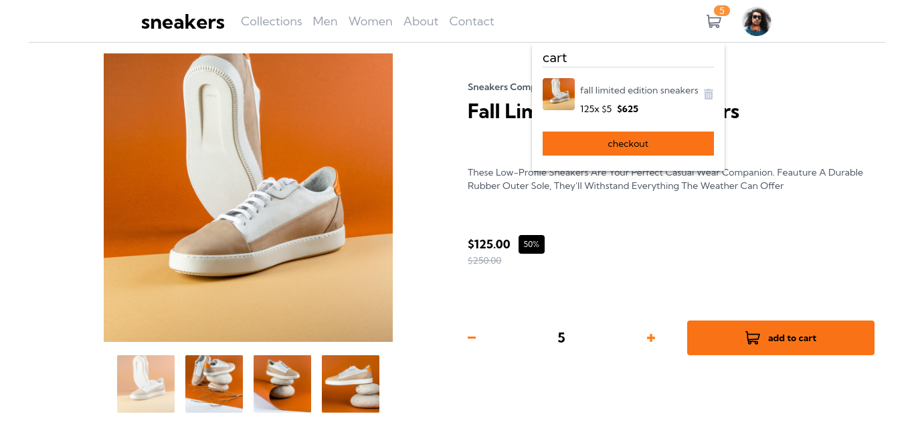

# Frontend Mentor - E-commerce product page solution

This is a solution to the [E-commerce product page challenge on Frontend Mentor](https://www.frontendmentor.io/challenges/ecommerce-product-page-UPsZ9MJp6). Frontend Mentor challenges help you improve your coding skills by building realistic projects.

## Table of contents

- [Overview](#overview)
  - [The challenge](#the-challenge)
  - [Screenshot](#screenshot)
  - [Links](#links)
- [My process](#my-process)
  - [Built with](#built-with)
  - [What I learned](#what-i-learned)
  - [Continued development](#continued-development)
  - [Useful resources](#useful-resources)
- [Author](#author)
- [Acknowledgments](#acknowledgments)

## Overview

### The challenge

Users should be able to:

- View the optimal layout for the site depending on their device's screen size
- See hover states for all interactive elements on the page
- Open a lightbox gallery by clicking on the large product image
- Switch the large product image by clicking on the small thumbnail images
- Add items to the cart
- View the cart and remove items from it

### Screenshot



### Links

- Solution URL: [frontendmentor solution URL](https://www.frontendmentor.io/solutions/e-commerce-product-page-Ad1dDTNhCT)
- Live Site URL: [vercel](https://frontend-mentor-e-commerce-product-page-alpha.vercel.app/)

## My process

### Built with

- [React](https://reactjs.org/) - JS library.
- [TailwindCSS](https://tailwindcss.com/) - For styles.
- [Zustand](https://zustand-demo.pmnd.rs/) - For state management.

### What I learned

I used React, TailwindCSS, and Zustand to build this project.

```js
import { useState } from "react";
import { useLightBoxStore } from "../store";

export const useLightBoxHook = (images) => {
  const closeLightBox = useLightBoxStore((state) => state.closeLightBox);
  const selectedImage = useLightBoxStore((state) => state.selectedImage);
  const changeImage = useLightBoxStore((state) => state.changeImage);
  const [currentImage, setCurrentImage] = useState(0);
  const handlePrevImage = () => {
    setCurrentImage((currentImage - 1 + images.length) % images.length);
    changeImage(currentImage);
  };
  const handleNextImage = () => {
    setCurrentImage((currentImage + 1) % images.length);
    changeImage(currentImage);
  };
  return { closeLightBox, selectedImage, handleNextImage, handlePrevImage };
};
```

### Continued development

I will continue building challenges with more technologies such as `Vue`, `Svelte`, and `Solid`.

## Author

- Website - [my portfolio](https://abdelmonaem-portfolio.vercel.app/)
- Frontend Mentor - [@coder-abdo](https://www.frontendmentor.io/profile/coder-abdo)
- LinkedIn - [abdelmonaem](https://www.linkedin.com/in/abdelmonaem/)
